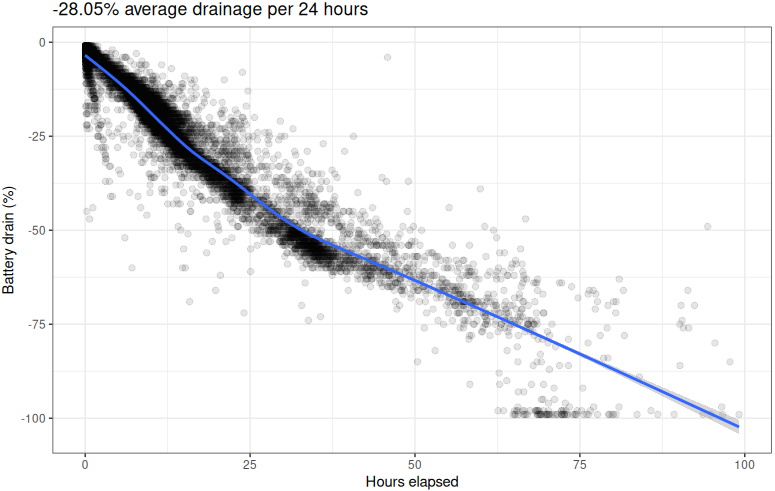
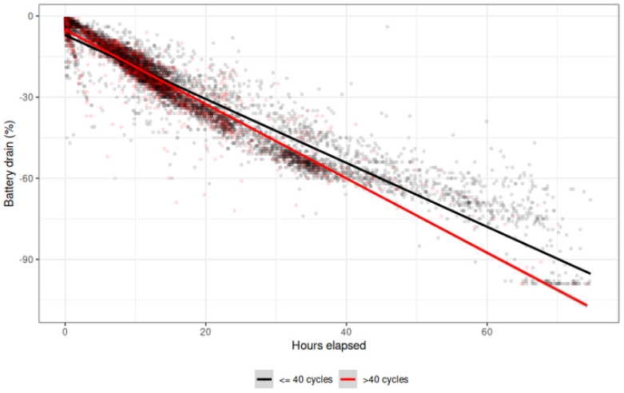
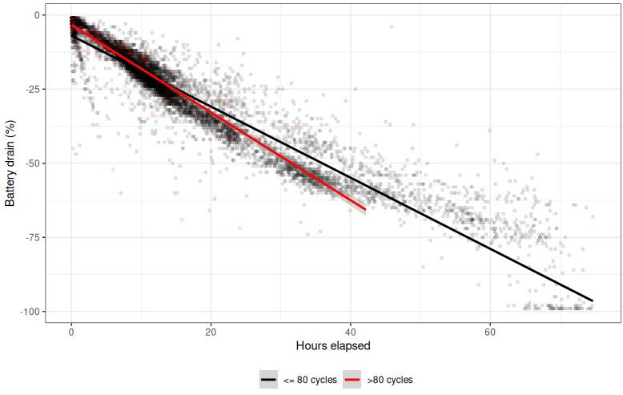
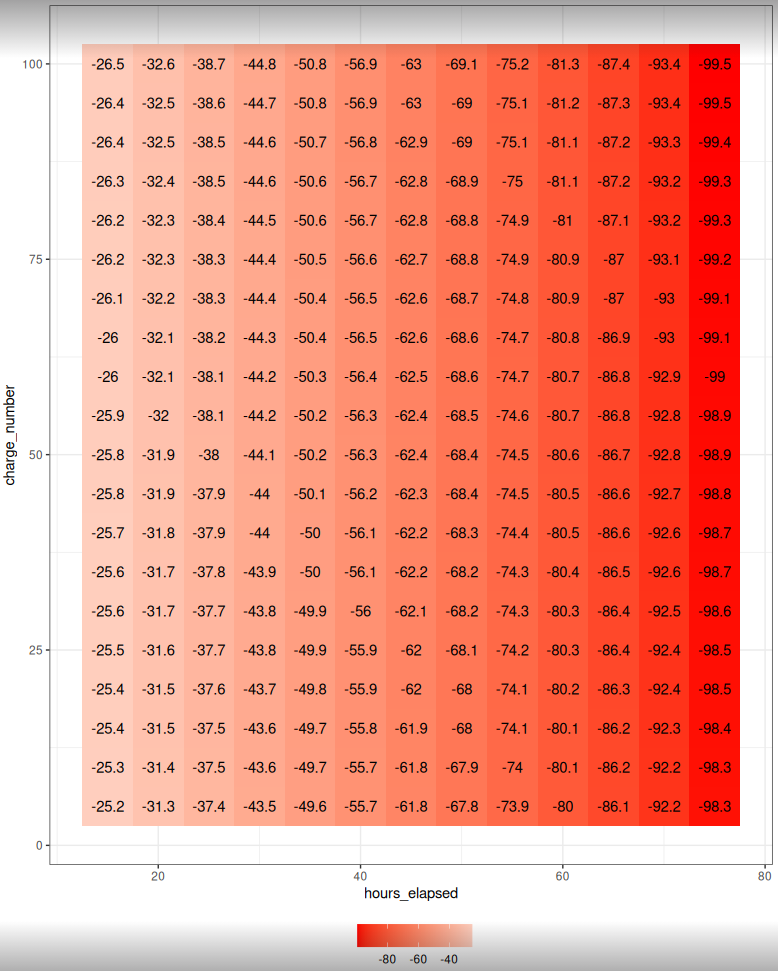
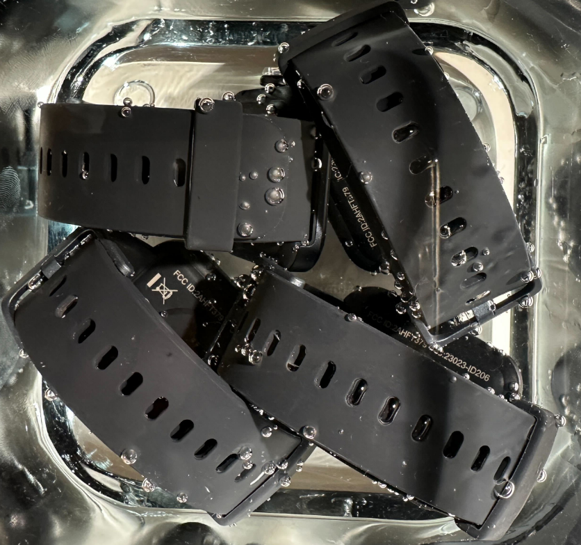
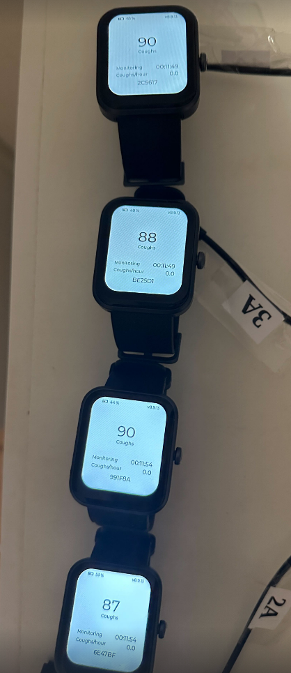
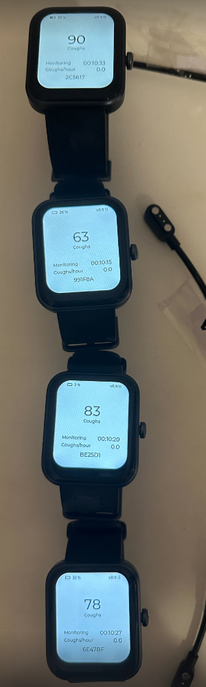

# Verification of Battery Durability, Microphone Reliability, and Device Performance Integrity

To ensure consistent and reliable operation of Hyfe’s CoughMonitor Suite (CMS) in clinical and real-world research environments, Hyfe implements multiple layers of verification testing focused on device durability, sensor reliability, and ongoing performance integrity. These procedures encompass in-study battery durability assessments, microphone robustness testing under water-exposure stress, and continuous monitoring for anomalous system behavior that may indicate device malfunction. In addition, Hyfe ensures that all research deployments use new devices to mitigate the risks associated with hardware degradation over time.

## In-Study Verification of Battery Durability

Battery reliability is a critical determinant of longitudinal data completeness in real-world evidence (RWE) studies. To verify that devices maintain expected operational performance throughout the duration of a study, Hyfe conducts ongoing in-study battery durability assessments. These analyses employ passive logging of battery charge level as a function of time across all active devices in the field.

These in-study evaluations enable early detection of atypical discharge behavior, which can indicate hardware defects, battery aging, or charging-related anomalies. When deviations are identified, Hyfe initiates targeted device replacement or participant follow-up to prevent data loss and maintain protocol compliance. Overall, this real-world monitoring framework confirms that the devices sustain stable battery performance under authentic usage conditions.

In these studies, it has been determined that the device drains at approximately a rate of 28% per 24 hours.

Old (>40 prior cycles) and new (<40 cycles) have been compared. The effect of 40 prior cycles on battery durability is negligible (see below chart). 

The same comparison was made between older (>80 cycles) and younger (<80 cycles) devices. Though the rate at which batteries drained was greater than at the >40 threshold, the effect is still minor, with the resultant cumulative time-to-empty still greater than the 3 days barrier.

Used the empirical battery values observed in these RWE trials, a matrix of predictions was generated estimating battery drain as a function of hours elapsed since full charge (x-axis) and prior charges (y-axis). In all cases, up to 100 charges, the battery is expected to surpass the 3 days barrier (see below chart).

## Verification of Microphone Reliability After Water Exposure

A subset of device reliability testing conducted by Hyfe focuses on ensuring that acoustic sensing performance is preserved following brief exposure to water, a realistic scenario for wearable devices and handheld sensors (for example, during dishwashing or bathing). To investigate microphone robustness to water exposure, Hyfe performed intentional submersion testing, in which devices were exposed to controlled water immersion consistent with common scenarios, 10 times (see below image).

Cough detection capability was assessed via the playback of 100 coughs via controlled speaker. Following this exposure, all devices' sensitivity remained within the range of expectations (ie, 85-90%) (see below image).

These tests demonstrated that the microphones retained functional acoustic integrity even after repeated water-exposure cycles, with no systematic deterioration in cough-detection performance. This provides strong evidence that the sensing pipeline is robust to realistic environmental challenges, such as showering or bathing.

A subsequent test saw devices submerged for 20 consecutive hours. The same assessment was carried out following submersion. In this case, significant performance deterioration occurred in 3 of 4 devices (see below image).

Accordingly, study participants are told that occasional short-term water exposure is acceptable, but that prolonged submersion should be avoided.

## Continuous Monitoring for Anomalous Cough-Frequency Patterns

In addition to physical durability testing, Hyfe employs continuous, real-time surveillance to ensure reliable device function during data collection. The system monitors for unexpected or physiologically implausible cough-frequency patterns, which may signal device malfunction rather than genuine participant symptoms.

Examples of anomalies include:

- Zero cough activity across prolonged periods in participants with established baseline cough rates
- Sudden, extreme decreases in detected events suggestive of microphone obstruction, moisture interference, or sensor displacement
- Abrupt spikes in detected coughs inconsistent with expected physiological ranges

When such patterns are detected, automated alarms and alerts are generated, prompting investigation by Hyfe’s technical team and/or study staff. This monitoring framework has successfully identified episodes of microphone obstruction (e.g., covered devices, damaged housings) and ensures that data anomalies are addressed rapidly to preserve the integrity of study outcomes.

## Use of New Devices to Prevent Performance Degradation

To ensure that device performance remains consistent and free from confounding effects related to prior wear, Hyfe deploys new devices for each study. This practice minimizes risks associated with:

- Battery aging or cycle fatigue
- Microphone degradation due to environmental exposure or mechanical wear
- Sensor drift, housing damage, or loss of water-resistance integrity
- Any cumulative deterioration that could affect acoustic fidelity or device responsiveness

By standardizing on unused hardware at study initiation, Hyfe ensures that all devices meet manufacturer specifications and internal performance benchmarks, thereby strengthening the validity and reproducibility of study outcomes.

## Conclusion

In summary, Hyfe employs a comprehensive and proactive approach to hardware reliability verification, integrating in-study battery assessments, water-exposure stress testing, continuous monitoring for anomalous acoustic behavior, and the use of new devices for each research deployment. These procedures collectively safeguard data quality and ensure robust performance of the system across diverse research settings.

