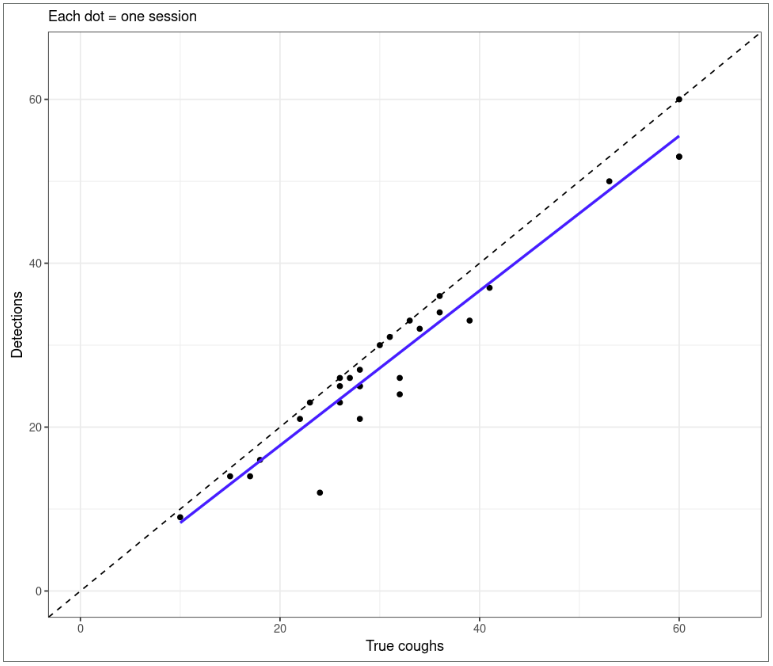
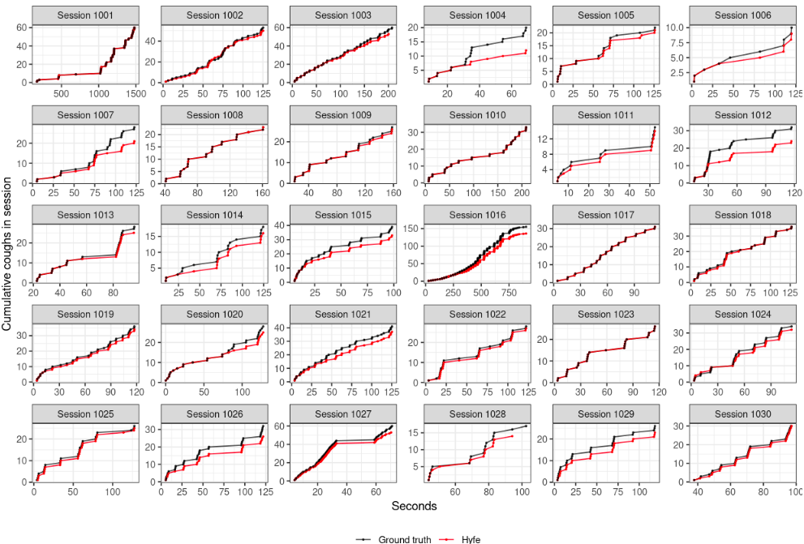
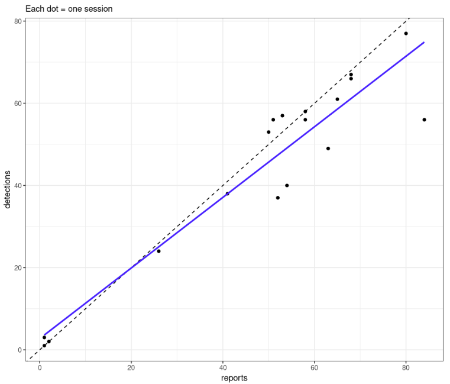
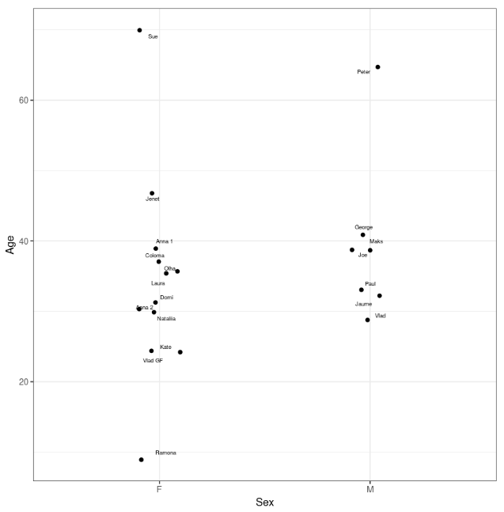

# Human field tests

[Accuracy tests](accuracy.html) demonstrate that a candidate model performs while on audio. But field tests (using human volunteers) are required to ensure that the model runs appropriately on device.

Two kinds of on-device human field tests have been carried out:

## Test set-up

- TEST A: On a modified variant of the production software in which audio was retained so that a human annotator could count the number of coughs post-hoc and compare with device-generated counts:
	- 17 distinct subjects
	- Approximately 60 minutes of person-time (30 sessions of approximately 2 minutes; sessions were short and intentionally bout-filled)
	- 1,078 coughs (human annotated on audio files)
- TEST B: Testers noting the exact number of coughs during the time period in question (ie, no audio retention and no human labeling):
	- 10 distinct subjects (some overlap with testers from test A)
	- 23.5 hours of person-time
	- 874 coughs (human reported)

## Test results

### TEST A: 

	- 1,078 coughs, from 17 subjects, mostly in bouts
	- 966 true positives (ie, sensitivity = 89.6%)
	- 9 false positives (mostly throat clears following cough bouts)

The below shows the correlation between true coughs (x-axis) and cough detections (y-axis) from Test A.

The below shows time elapsed (x-axis) and cumulative coughs (y-axis) for both ground truth (black) and Hyfe (red) as data sources.

	
### TEST B: 

	- 874 coughs from 10 subjects
	- 830 detections
	- (No segregation of true vs false positives, given that “ground truth” was human reported session-wise counts, not human labels or event-specific timestamps)

The below shows reported coughs (x-axis) and cough detections (y-axis).

### Demographics

The below shows the age / sex distribution of participants in the above tests.

