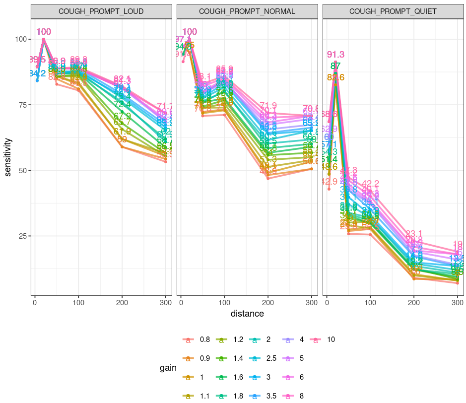
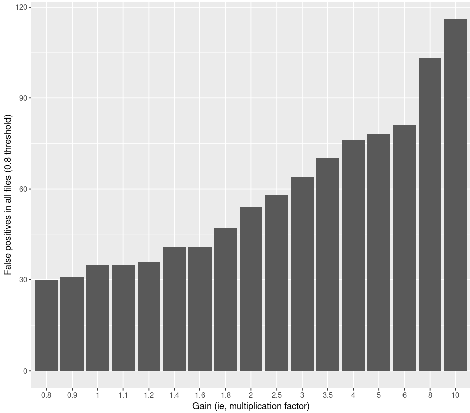
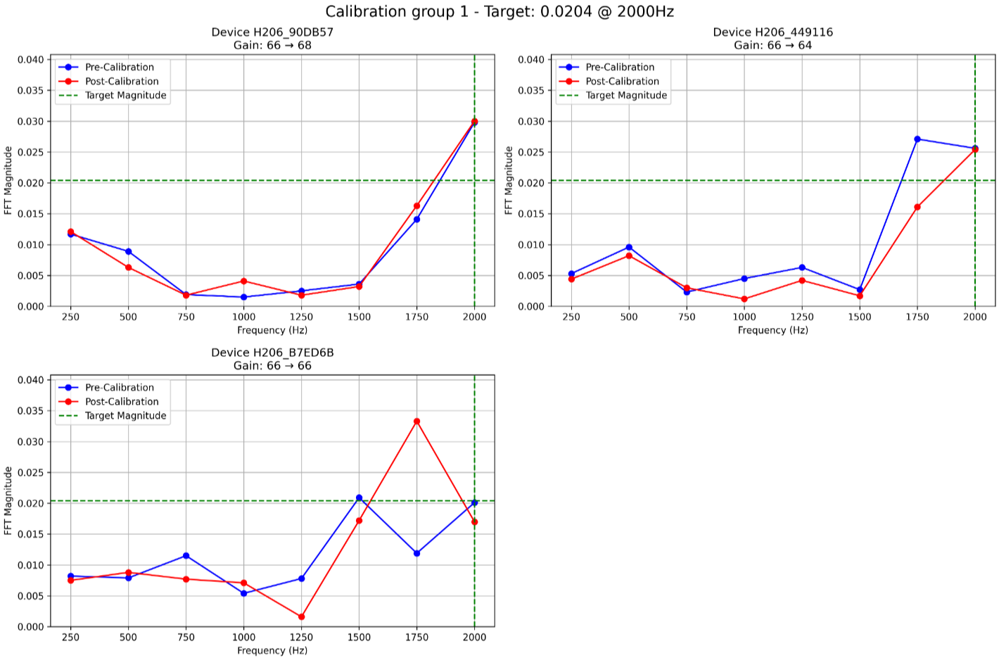
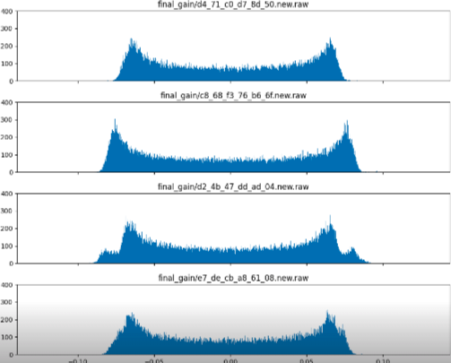

# Microphone Gain Verification

Microphone gain—the amplification applied to an acoustic input signal prior to digitization—is a potential source of variability in audio-based sensing systems. In the context of cough monitoring technologies, differences in microphone gain could theoretically influence the apparent intensity, spectral characteristics, and detectability of cough events. Because Hyfe’s cough monitoring algorithms depend on consistent acoustic capture across diverse devices, it was important to determine whether device-to-device variability in microphone gain could materially influence detection sensitivity (or false positivity rates) or require per-device calibration procedures.

To evaluate this, Hyfe conducted controlled laboratory assessments designed to isolate the effect of microphone gain on cough detection performance. The testing involved exposing multiple representative devices to standardized acoustic stimuli, including recorded human coughs, played at reproducible levels in an acoustically controlled environment. This approach allowed gain-dependent variation in the recorded signals to be measured independently of extraneous environmental or behavioral factors.

The data demonstrated that varying microphone gain did indeed affect sensitivity. The below chart shows sensitivity to cough on three perceived "volumes" of coughs, at varying gain levels. 

Gain was also found to have a significant effect on the rate of false positives (below chart).

Given that different gain levels produced different cough detection accuracy, the analysis team used a decibelometer and standardized synthetic frequencies to identify de facto differences in gain across devices, in an effort to homogenize gain through posterior adjustment. The below shows an example of this calibration.

The variance in gain levels which were found to have a meaningful effect on cough detection rates fell far outside the de facto variance in gain across devices. 
In other words, diversity in observed gain per devices was found to be within the operational ranges typical for consumer-grade device hardware (below chart shows empirical amplitude values over pre-defined homogenized audio from different mics in the test batch, with near uniform average amplitude and only minor, in-spec diversity in range).

Given the lack of heterogeneity in de facto gain per device, these minor differenes were determined to produce only minor variation in the amplitude and spectral representation of cough-like acoustic events. When these recordings were processed using Hyfe’s detection algorithms, the resulting changes in sensitivity and signal classification confidence were negligible. Importantly, although small amplitude shifts were observed—as expected when modifying pre-amplification parameters—these variations did not meaningfully affect the algorithm’s ability to identify cough events. This suggests that the modeling approach is robust to modest front-end signal level differences.

Further analysis compared microphones across multiple devices from different production batches. In line with normal manufacturing tolerances, measured gain differences between units were minimal. The microphones exhibited consistent frequency response and overall acoustic sensitivity, and any intrinsic variability fell well within the tolerance range demonstrated to be inconsequential during the controlled gain-alteration experiments. Thus, device-to-device heterogeneity in microphone gain exists, but was not found to be a relevant factor affecting overall system performance.

Based on these findings, Hyfe concluded that device-specific calibration or gain adjustment procedures are not required for reliable cough detection. The combination of stable microphone behavior across devices and the algorithm’s tolerance to minor input-level variation ensures that sensitivity remains consistent without additional calibration steps. This simplifies deployment, supports scalability across device models, and reinforces the robustness of the acoustic sensing pipeline under real-world conditions.

Overall, the microphone gain verification study provides strong evidence that microphone gain is not a limiting factor in system performance, and that Hyfe’s cough detection technology functions reliably across devices without the need for individualized adjustment or calibration.

Manufacturer documentation on the microphone used in the ID206 is available <a href="../pdfs/mic.pdf" target="_blank">here</a>.

